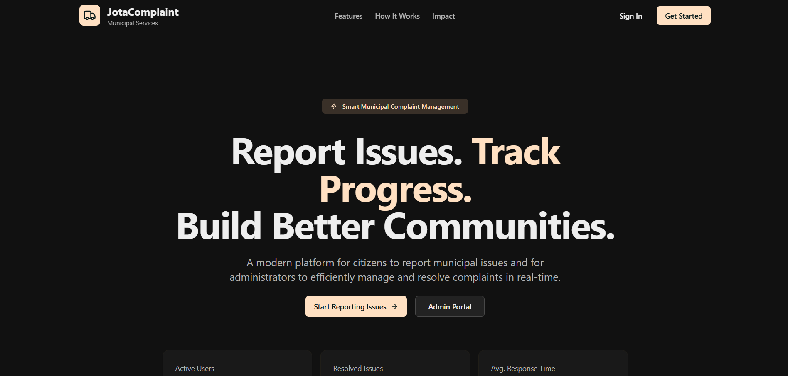

# JotaComplaint- Municipal Complaint Management System

<p align="center">
  
</p>

## Demo:
https://jotacomplaint.onrender.com/

A modern, full-stack web application built with the **T3 Stack** (Next.js 15, TypeScript, Tailwind CSS, Prisma, Auth.js) for efficient municipal complaint tracking and resolution.

[](https://nextjs.org/)
[](https://www.typescriptlang.org/)
[](https://prisma.io)
[](https://tailwindcss.com/)

---

## ✨ Features

### **Core Functionality**

- **Multi-Role System:** Admin, Staff, Regular Users
- **Real-time Complaint Tracking:** Create, assign, update, resolve
- **Image Uploads:** Powered by ImageKit
- **Role-Based Access Control**
- **Responsive Design:** Desktop, tablet, and mobile

### **Admin Dashboard**

- Analytics with interactive charts (Recharts)
- User management (activate/deactivate)
- Department & category management
- Real-time statistics & trends
- Complaint overview & insights

### **Staff Features**

- Assigned complaint management
- Status updates with history tracking
- Internal comment system
- Priority handling (Low / Medium / High)

### **User Features**

- Submit complaints with photos & location
- View status & history in real time
- Profile management

### **Technical Features**

- **Server Actions** & **Server Components**
- Fully **type-safe** (TypeScript)
- **shadcn/ui** modern component system
- **Prisma ORM** with PostgreSQL
- **Auth.js** with DB sessions
- **ImageKit** optimization & CDN support

---

## 🛠 Tech Stack

| Area       | Tech                                            |
| ---------- | ----------------------------------------------- |
| Frontend   | Next.js 15, TypeScript, Tailwind CSS, shadcn/ui |
| Backend    | Next.js API Routes, Prisma                      |
| Auth       | Auth.js (database sessions)                     |
| Database   | PostgreSQL                                      |
| Maps       | Google Maps API                                 |
| Images     | ImageKit                                        |
| Charts     | Recharts                                        |
| Deployment | Vercel / Railway / Docker                       |

---

## 🚀 Quick Start

### **Prerequisites**

```bash
Node.js 20+
PostgreSQL 15+
ImageKit Account
```

### **1. Clone & Install**

```bash
git clone
cd jotacomplaint
npm install
```

### **2. Environment Setup**

```bash
cp .env.example .env

# Update .env

# Database
DATABASE_URL=""

# Auth
AUTH_SECRET="your-super-secret-key"
AUTH_URL="http://localhost:3000"


# ImageKit (optional)
IMAGEKIT_PUBLIC_KEY="your-public-key"
IMAGEKIT_PRIVATE_KEY="your-private-key"
IMAGEKIT_URL_ENDPOINT=""

```

### **3. Database Setup**

```bash
# Generate Prisma Client
npx prisma generate

# Push schema
npx prisma db push

# Seed data (optional)
npx prisma db seed
```

## 🌍 Access

- User → http://localhost:3000
- Admin → http://localhost:3000/admin
- Staff → http://localhost:3000/staff

## 🔐 Default Credentials

- Admin: admin@example.com / 12345678
- Staff: staff@example.com / 12345678
- User: user@example.com / 12345678
