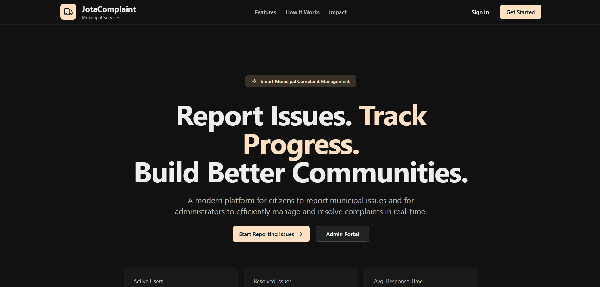

# JotaComplaint V2 — Municipal Complaint Management System

<p align="center">
  
</p>

A production-grade, full-stack municipal service platform for citizen grievance redressal. Rebuilt for **V2** with a focus on enterprise patterns: 3-tier architecture, background job processing, real-time sync, and SLA management.

[](https://nextjs.org/)
[](https://www.typescriptlang.org/)
[](https://prisma.io)
[](https://tailwindcss.com/)
[](https://upstash.com/)
[](https://pusher.com/)

---

## 🏗 Architecture & Patterns

- **3-Tier Architecture**: Clean separation between API/Actions (Controllers) → Services (Business Logic) → Prisma (Data Access).
- **Background Jobs**: BullMQ handles heavy lifting (emails, SLA checks, automated assignments) via Redis.
- **Real-time Engine**: Pusher-powered live updates for dashboards, notifications, and status changes.
- **SLA Engine**: Automated `dueDate` calculation based on category/priority policies with countdown timers.
- **Distributed Caching**: Upstash Redis caching for expensive analytics queries with surgical invalidation.
- **Duplicate Detection**: Smart search for similar complaints using title text matching and geospatial proximity.

---

## ✨ Features

### **For Citizens**
- **Smarter Submission**: Report issues with GPS-tagged locations (Leaflet) and photo evidence (ImageKit).
- **Real-time Tracking**: Live status updates and internal/public comment threads.
- **Instant Notifications**: Browser and email alerts when your case is assigned or resolved.

### **For Staff & Admins**
- **Unified Inbox**: Scoped views for assigned vs. departmental complaints.
- **SLA Monitoring**: Visual countdowns and color-coded priority indicators to prevent breaches.
- **Role-Based Access (RBAC)**: Secure access control enforced at both middleware and service layers.
- **Audit Trails**: Complete activity history for every complaint (who changed what and when).
- **Analytics Dashboard**: Real-time stats, trend charts (Recharts), and departmental performance breakdown.

---

## 🛠 Tech Stack

| Layer | Technology |
|---|---|
| **Frontend** | Next.js 16 (App Router), React 19, Tailwind CSS 4, shadcn/ui |
| **Backend** | Service-oriented architecture, Server Actions, Next.js API |
| **Database** | PostgreSQL + Prisma 6.5 |
| **Auth** | Auth.js v5 (Database sessions) |
| **Queues** | BullMQ + Upstash Redis |
| **Real-time** | Pusher Channels |
| **Email** | Resend + React Email templates |
| **Maps** | Leaflet.js (OpenStreetMap) |
| **Images** | ImageKit.io CDN |

---

## 🚀 Getting Started

### **1. Prerequisites**
- Node.js 20+
- PostgreSQL
- Upstash Redis (or local Redis)
- Pusher Account
- Resend Account
- ImageKit Account
- Docker (optional, for one-command local stack)

### **2. Installation**
```bash
git clone https://github.com/yourusername/jotacomplaint.git
cd jotacomplaint
npm install
```

### **3. Environment Setup**
Copy `.env.example` to `.env` and fill in:
- `DATABASE_URL` (PostgreSQL)
- `AUTH_SECRET` (Generate with `npx auth secret`)
- `REDIS_URL` (Upstash HTTP) and `REDIS_TCP_URL` (for BullMQ)
- `PUSHER_APP_ID`, `NEXT_PUBLIC_PUSHER_KEY`, etc.
- `RESEND_API_KEY`
- `IMAGEKIT_PUBLIC_KEY`, `IMAGEKIT_PRIVATE_KEY`, etc.

### **4. Database & Workers**
```bash
# Setup DB
npx prisma migrate dev
npx prisma db seed

# Run App
npm run dev

# Run Worker (Required for emails/jobs)
npm run worker
```

### **5. Dockerized Local Stack (Recommended for parity)**
```bash
# Build and start app + worker + postgres + redis
npm run docker:up

# Seed data inside app container
npm run docker:seed

# Stream logs
npm run docker:logs

# Stop everything
npm run docker:down
```

Docker compose details:
- App: `http://localhost:3000`
- PostgreSQL: `localhost:5432`
- Redis: `localhost:6379`
- App startup runs `prisma db push` automatically before `next start`

## 🔐 Default Test Accounts
- **Admin**: `admin@municipality.gov` / `12345678`
- **Staff**: `water.officer@municipality.gov` / `12345678`
- **User**: `rajesh.kumar@gmail.com` / `12345678`
