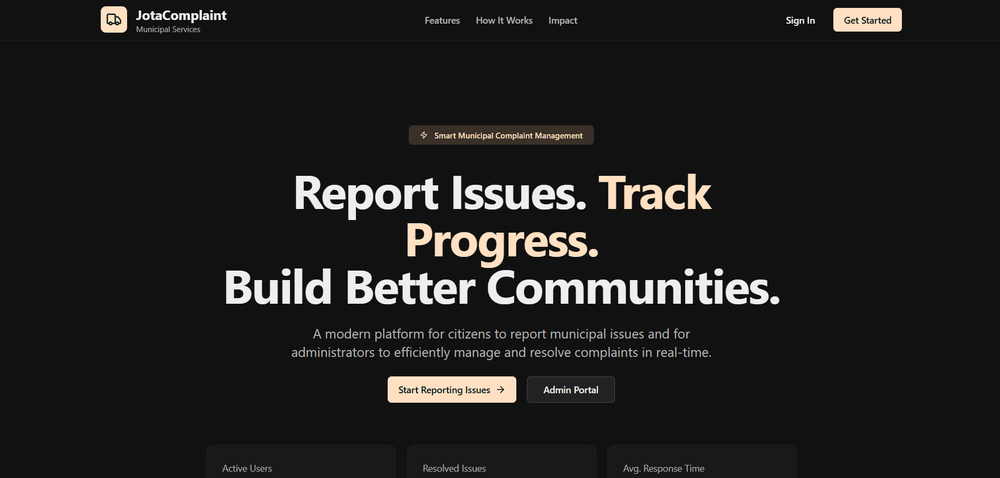

# JotaComplaint V2 — Municipal Complaint Management System

<p align="center">
  
</p>

A production-grade, full-stack municipal service platform for citizen grievance redressal. Rebuilt for **V2** with a focus on enterprise patterns: 3-tier architecture, background job processing, and SLA management.

[](https://nextjs.org/)
[](https://www.typescriptlang.org/)
[](https://prisma.io)
[](https://tailwindcss.com/)
[](https://upstash.com/)
---

## 🏗 Architecture & Patterns

- **3-Tier Architecture**: Clean separation between API/Actions (Controllers) → Services (Business Logic) → Prisma (Data Access).
- **Background Jobs**: Upstash QStash handles async processing (emails, SLA escalation, weekly digests, cleanup) — serverless-native, no persistent worker process required.
- **SLA Engine**: Automated `dueDate` calculation based on category/priority policies with countdown timers.
- **Distributed Caching**: Upstash Redis caching for expensive analytics queries with surgical invalidation.
- **Duplicate Detection**: Smart search for similar complaints using title text matching and geospatial proximity.

---

## ✨ Features

### **For Citizens**
- **Smarter Submission**: Report issues with GPS-tagged locations (Leaflet) and photo evidence (AWS S3).
- **Complaint Tracking**: Status updates and internal/public comment threads.
- **Instant Notifications**: Browser and email alerts when your case is assigned or resolved.

### **For Staff & Admins**
- **Unified Inbox**: Scoped views for assigned vs. departmental complaints.
- **SLA Monitoring**: Visual countdowns and color-coded priority indicators to prevent breaches.
- **Role-Based Access (RBAC)**: Secure access control enforced at both middleware and service layers.
- **Audit Trails**: Complete activity history for every complaint (who changed what and when).
- **Analytics Dashboard**: Complaint stats, trend charts (Recharts), and departmental performance breakdown.

---

## 🛠 Tech Stack

| Layer | Technology |
|---|---|
| **Frontend** | Next.js 16 (App Router), React 19, Tailwind CSS 4, shadcn/ui |
| **Backend** | Service-oriented architecture, Server Actions, Next.js API |
| **Database** | PostgreSQL + Prisma 6.5 |
| **Auth** | Auth.js v5 (Database sessions) |
| **Queues** | Upstash QStash (serverless HTTP job queue) |
| **Email** | Resend + React Email templates |
| **Maps** | Leaflet.js (OpenStreetMap) |
| **Images** | AWS S3 (private, presigned URLs) |
| **Infrastructure** | Terraform (IaC for S3 and IAM) |

---

## 🚀 Getting Started

### **1. Prerequisites**
- Node.js 20+
- PostgreSQL
- Upstash account (Redis for caching + QStash for background jobs)
- Resend Account
- AWS Account (for S3 uploads)
- Docker (optional, for one-command local stack)

### **2. Installation**
```bash
git clone https://github.com/yourusername/jotacomplaint.git
cd jotacomplaint
npm install
```

### **3. Environment Setup**
Copy `.env.example` to `.env` and fill in:
- `DATABASE_URL` (PostgreSQL connection string)
- `AUTH_SECRET` (generate with `npx auth secret`)
- `UPSTASH_REDIS_REST_URL` + `UPSTASH_REDIS_REST_TOKEN` (caching + rate limiting)
- `QSTASH_TOKEN` + `QSTASH_CURRENT_SIGNING_KEY` + `QSTASH_NEXT_SIGNING_KEY` (background jobs)
- `NEXT_PUBLIC_APP_URL` (public base URL — used by QStash as callback target)
- `RESEND_API_KEY`
- `AWS_REGION`, `AWS_ACCESS_KEY_ID`, `AWS_SECRET_ACCESS_KEY`, `S3_UPLOAD_BUCKET`

### **4. Terraform (AWS S3) Setup**
Provisions the S3 bucket and IAM user for image uploads.
```bash
cd infra/aws
cp terraform.tfvars.example terraform.tfvars
# Edit terraform.tfvars with your values
terraform init
terraform apply
```
After applying, copy the access keys into your `.env`.

### **5. Database Setup**
```bash
# Setup DB
npx prisma migrate dev
npx prisma db seed

# Run App
npm run dev
```

> **Note on local job testing**: QStash delivers jobs by HTTP-POSTing to your app's public URL.
> For local development, use the QStash CLI dev server:
> ```bash
> npx @upstash/qstash-cli dev
> ```
> Or expose localhost with [ngrok](https://ngrok.com/) and set `NEXT_PUBLIC_APP_URL` to the tunnel URL.

### **6. Register Cron Schedules (one-time, per environment)**
After your first production deploy, register the 3 QStash cron schedules:
```bash
QSTASH_TOKEN=... NEXT_PUBLIC_APP_URL=https://your-app.vercel.app \
  npx tsx scripts/register-qstash-schedules.ts
```
This creates schedules for: SLA escalation (every 15 min), weekly digest (Mon 9am), cleanup (daily midnight).

### **7. Dockerized Local Stack (Recommended for parity)**
```bash
# Build and start app + worker + postgres + redis
npm run docker:up

# Seed data inside app container
npm run docker:seed

# Stream logs
npm run docker:logs

# Stop everything
npm run docker:down
```

Docker compose details:
- App: `http://localhost:3000`
- PostgreSQL: `localhost:5432`
- App startup runs `prisma db push` automatically before `next start`
- No Redis container or worker container needed — background jobs use Upstash QStash (external, HTTP-based)

## 🔐 Default Test Accounts
- **Admin**: `admin@municipality.gov` / `12345678`
- **Staff**: `water.officer@municipality.gov` / `12345678`
- **User**: `rajesh.kumar@gmail.com` / `12345678`
